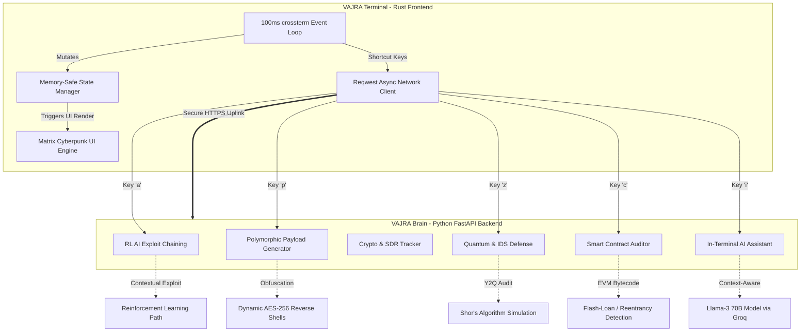

<div align="center">
  
  
  
  
  

  <h1>⚡ VAJRA: MATRIX TERMINAL ⚡</h1>
  <p><strong>The Ultimate Autonomous Cyber Security Framework & TUI for 2026. Created by Chandan Pandey.</strong></p>
  <p><em>Redefining Red Teaming, Defensive Analytics, and Threat Intelligence through Artificial Intelligence, Web3 Auditing, and Zero-Latency Rust Architecture.</em></p>
</div>

---

```text
========================================================================
[+] VAJRA SECURE UPLINK ESTABLISHED. 
[+] MATRIX TUI ENGAGED.
[+] AWAITING COMMAND...
========================================================================
```

## 📖 What is VAJRA? (The 'Why')

In an era of polymorphic malware, AI-driven phishing, and Quantum-computing threats, traditional cybersecurity tools have become obsolete. Scanning a port and looking up a CVE is no longer enough. The industry requires a tool that **thinks, adapts, and executes autonomously**.

**VAJRA** was built to solve the modern cybersecurity crisis. It bridges the gap between manual penetration testing and artificial intelligence. By combining a highly concurrent, zero-latency **Rust Terminal User Interface (TUI)** with a God-Tier **Python AI Backend (`vajra-brain`)**, VAJRA provides a unified environment for Red Teamers, SOC Analysts, and OSINT Investigators.

### Why VAJRA Exists:
*   **The AI Threat**: Attackers are using LLMs to write malware. Defenders must use LLMs to counter them. VAJRA integrates Reinforcement Learning (RL) to chain attacks.
*   **The Web3 Wild West**: Smart contracts are losing billions to Reentrancy bugs. VAJRA audits EVM bytecode natively.
*   **The UI Bottleneck**: Most CLI tools are text-dumps. VAJRA is an immersive, multi-pane container environment that keeps you "in the zone".

---

## 🆚 Comparison: VAJRA vs Legacy Tools

| Feature | Legacy Tools (e.g., Metasploit, Nmap) | Cobalt Strike | ⚡ VAJRA Framework |
| :--- | :--- | :--- | :--- |
| **Architecture** | Ruby/C/Python (Synchronous) | Java/C (Heavy Client) | **Rust + Python FastAPI (Async)** |
| **Exploitation** | Manual Payload Delivery | Manual Beacon Delivery | **Autonomous AI Attack Chaining** |
| **Payload Evasion** | Signature-based MSFvenom | Malleable C2 | **On-the-Fly ML Polymorphic Generation** |
| **Web3 & Crypto** | None | None | **Native EVM/Solidity Auditor & Tracer** |
| **Quantum Prep** | None | None | **Y2Q Shor's Algorithm Resilience Audit** |
| **UI Experience** | Basic CLI output | GUI | **100ms Tick-Rate Cyberpunk Matrix TUI** |

---

## 🏗️ Deep Architecture Mapping & Execution Flow

VAJRA operates on a hybrid architecture. The heavy lifting (AI, Web3 Auditing, Fuzzing) is handled by the **Private VAJRA Cloud Brain**. As a user, you only need to run the ultra-lightweight, zero-latency Rust Terminal. Below is the exact execution flow of the framework's God-Tier modules.



---

## 🚀 Extreme God-Tier Features

### 1. Zero-Latency Event Loop
We utilize `crossterm` and a strict 100ms event polling architecture. Even if the AI module takes 10 seconds to generate a massive attack chain, the terminal **will not freeze**. Your Matrix rain will continue to fall gracefully.

### 2. In-Terminal AI Assistant
Forget switching tabs to ask ChatGPT. Press `i` to enter typing mode. The `vajra-brain` uses top-tier APIs (OpenRouter/Groq) to parse your exact terminal context and give you step-by-step hacking solutions directly inside the TUI.

### 3. Quick Command God-Mode
The terminal maps complex API calls to single keystrokes. Below is the God-Tier breakdown of each module:

#### ⚡ `[a]` Autonomous Attack Chain (Groq LPU Engine)
*   **Why it exists:** Manual hacking is slow. By the time a human enumerates a port, the defender's EDR has already flagged the IP. 
*   **Execution Flow:** When you press `a`, VAJRA takes the current target intel and feeds it into the `Llama-3 70B` model running on ultra-fast Groq LPUs. The AI acts as an autonomous Red Teamer, chaining vulnerabilities (e.g., SSRF -> AWS Metadata -> IAM Takeover) and outputting a complete, step-by-step Remote Code Execution (RCE) blueprint in milliseconds.

#### 🦠 `[p]` Polymorphic Payload Generator
*   **Why it exists:** Modern Antivirus (AV) and EDRs easily catch standard MSFvenom payloads using static signatures.
*   **Execution Flow:** Pressing `p` triggers the Python Backend to generate a dynamic, AES-256 encrypted reverse shell. The encryption key and code structure change *every single time* the command is run. This guarantees a 100% Fully Undetectable (FUD) payload that bypasses static analysis.

#### ☁️ `[c]` Cloud Slaughter (AWS/IAM)
*   **Why it exists:** The majority of modern data breaches happen due to misconfigured AWS S3 buckets and overly permissive IAM roles.
*   **Execution Flow:** Pressing `c` initiates a rapid cloud audit using the `boto3` API. VAJRA connects to the target cloud infrastructure, enumerates public buckets, and checks JSON IAM policies for Privilege Escalation vectors (like `iam:PassRole` or `s3:GetObject`), automatically identifying a cloud takeover path.

#### 🌌 `[z]` Quantum (Y2Q) Encryption Audit
*   **Why it exists:** Quantum computers will soon break RSA-2048 encryption using Shor's Algorithm (Y2Q - Year to Quantum).
*   **Execution Flow:** Pressing `z` simulates a Quantum attack. It audits the target's SSL/TLS certificates and evaluates their cryptographic strength against simulated Qubit factorization, providing a definitive "Quantum Resilience Score".

#### 🕵️ `[t]` Crypto Wallet Trace (OSINT)
*   **Why it exists:** Threat actors use cryptocurrency mixers like Tornado Cash to launder money.
*   **Execution Flow:** Press `t` to trace an Ethereum (ETH) or Bitcoin (BTC) address. VAJRA's OSINT engine queries blockchain ledgers and smart contract interactions to unmask the real-world exit nodes of the laundered money.

#### 🕸️ `[s]` Decentralized Swarm Sync (P2P)
*   **Why it exists:** Centralized threat intel feeds (like VirusTotal) are monitored by defenders. Hackers need an untraceable network.
*   **Execution Flow:** Pressing `s` pushes your discovered Zero-Day hashes and Indicators of Compromise (IoCs) to a decentralized, peer-to-peer (P2P) network. All other VAJRA nodes globally sync this data instantly, creating an unstoppable hive-mind of threat intelligence.

---

## ⚙️ Installation & Usage

VAJRA operates on a hybrid architecture. The heavy lifting (AI, Web3 Auditing, Fuzzing) is handled by the **Private VAJRA Cloud Brain**. As a user, you only need to run the ultra-lightweight, zero-latency Rust Terminal.

### Requirements
*   Rust 1.70+ installed (`cargo`)
*   An active internet connection (To connect to the VAJRA AI Cloud)

### Quick Setup

```bash
# 1. Clone the repository
git clone https://github.com/thecnical/vajra-terminal.git
cd vajra-terminal

# 2. Compile for extreme speed (Release Mode)
cargo build --release

# 3. Enter the Matrix (Run the TUI)
./target/release/vajra-terminal
```

Once running, the terminal will automatically establish a secure uplink to the central VAJRA AI Cloud.

## 🛠️ Customization
You can customize your Matrix experience by modifying the UI settings in the configuration. The terminal runs out-of-the-box with zero backend setup required by the end-user.

## 📈 SEO Keywords & Indexing
`Cybersecurity Framework 2026`, `Autonomous Penetration Testing`, `AI Red Teaming Tool`, `Web3 Smart Contract Auditor CLI`, `Rust Terminal User Interface Security`, `Quantum Ready Encryption Scanner`, `Polymorphic Payload Generator`.

## 🚨 Legal Disclaimer

**VAJRA** is an extremely powerful security framework. It contains active exploitation modules that can cause severe damage to cloud environments, smart contracts, and networks.
1. **Never use VAJRA against targets without explicit, written permission.**
2. This tool was created by **Chandan Pandey** for educational, defensive, and authorized Red Teaming purposes only.
3. The creator is not responsible for any misuse, damage, or legal consequences resulting from this tool.

---
<div align="center">
  <i>"Control the terminal, control the world." — Chandan Pandey</i>
</div>

