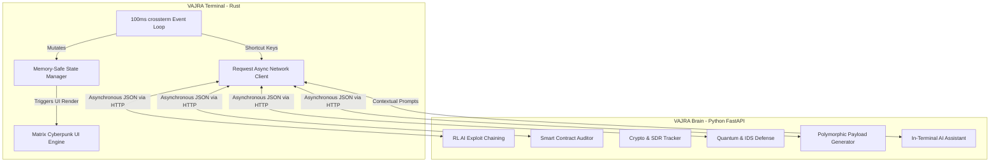

<div align="center">
  
  
  
  
  

  <h1>⚡ VAJRA: MATRIX TERMINAL ⚡</h1>
  <p><strong>The Ultimate Autonomous Cyber Security Framework & TUI for 2026. Created by Chandan Pandey.</strong></p>
  <p><em>Redefining Red Teaming, Defensive Analytics, and Threat Intelligence through Artificial Intelligence, Web3 Auditing, and Zero-Latency Rust Architecture.</em></p>
</div>

---


*(VAJRA Terminal operating in full Matrix Mode. Image representation.)*

## 📖 What is VAJRA? (The 'Why')

In an era of polymorphic malware, AI-driven phishing, and Quantum-computing threats, traditional cybersecurity tools have become obsolete. Scanning a port and looking up a CVE is no longer enough. The industry requires a tool that **thinks, adapts, and executes autonomously**.

**VAJRA** was built to solve the modern cybersecurity crisis. It bridges the gap between manual penetration testing and artificial intelligence. By combining a highly concurrent, zero-latency **Rust Terminal User Interface (TUI)** with a God-Tier **Python AI Backend (`vajra-brain`)**, VAJRA provides a unified environment for Red Teamers, SOC Analysts, and OSINT Investigators.

### Why VAJRA Exists:
*   **The AI Threat**: Attackers are using LLMs to write malware. Defenders must use LLMs to counter them. VAJRA integrates Reinforcement Learning (RL) to chain attacks.
*   **The Web3 Wild West**: Smart contracts are losing billions to Reentrancy bugs. VAJRA audits EVM bytecode natively.
*   **The UI Bottleneck**: Most CLI tools are text-dumps. VAJRA is an immersive, multi-pane container environment that keeps you "in the zone".

---

## 🆚 Comparison: VAJRA vs Legacy Tools

| Feature | Legacy Tools (e.g., Metasploit, Nmap) | Cobalt Strike | ⚡ VAJRA Framework |
| :--- | :--- | :--- | :--- |
| **Architecture** | Ruby/C/Python (Synchronous) | Java/C (Heavy Client) | **Rust + Python FastAPI (Async)** |
| **Exploitation** | Manual Payload Delivery | Manual Beacon Delivery | **Autonomous AI Attack Chaining** |
| **Payload Evasion** | Signature-based MSFvenom | Malleable C2 | **On-the-Fly ML Polymorphic Generation** |
| **Web3 & Crypto** | None | None | **Native EVM/Solidity Auditor & Tracer** |
| **Quantum Prep** | None | None | **Y2Q Shor's Algorithm Resilience Audit** |
| **UI Experience** | Basic CLI output | GUI | **100ms Tick-Rate Cyberpunk Matrix TUI** |

---

## 🏗️ Deep Architecture Mapping

VAJRA is split into two massive components to ensure stability and raw performance. The **Terminal (Frontend)** runs locally with zero overhead, while the **Brain (Backend)** can be hosted on cloud GPUs for intensive machine learning tasks.



---

## 🚀 Extreme God-Tier Features

### 1. Zero-Latency Event Loop
We utilize `crossterm` and a strict 100ms event polling architecture. Even if the AI module takes 10 seconds to generate a massive attack chain, the terminal **will not freeze**. Your Matrix rain will continue to fall gracefully.

### 2. In-Terminal AI Assistant
Forget switching tabs to ask ChatGPT. Press `i` to enter typing mode. The `vajra-brain` uses top-tier APIs (OpenRouter/Groq) to parse your exact terminal context and give you step-by-step hacking solutions directly inside the TUI.

### 3. Quick Command God-Mode
The terminal maps complex API calls to single keystrokes:
*   `[a]` **Autonomous Attack Chain**: Instantly maps target intel and generates a multi-stage RCE using AI.
*   `[p]` **Polymorphic Payload**: Generates a 100% FUD Base64/Obfuscated reverse shell in milliseconds.
*   `[c]` **Cloud Slaughter**: Audits AWS S3 and IAM JSON policies for Takeover/PrivEsc vectors.
*   `[z]` **Quantum (Y2Q) Audit**: Runs Shor's Algorithm checks to see if your target's RSA keys are vulnerable to Quantum Computers.
*   `[t]` **Crypto Trace**: Traces ETH wallets through mixing services (Tornado Cash).
*   `[s]` **Swarm Sync**: Pushes an IoC hash to the global decentralized P2P network.

---

## ⚙️ Installation & Deployment

It is strictly recommended to use the global `installer.sh` provided in the root repository. However, to build the terminal manually:

### Requirements
*   Rust 1.70+ (`cargo`)
*   VAJRA Brain running on `127.0.0.1:8000`

```bash
# Clone the repository
git clone https://github.com/thecnical/vajra-terminal.git
cd vajra-terminal

# Compile for extreme speed (Release Mode)
cargo build --release

# Run the environment
./target/release/vajra-terminal
```

## 🛠️ Configuration (`config.toml`)
Customize your Matrix experience by editing `config.toml`:

```toml
[network]
brain_url = "http://127.0.0.1:8000"

[ui]
theme = "cyberpunk" # Matrix Red & Neon Green
refresh_rate_ms = 100

[user]
alias = "Chandan Pandey"
level = "God-Tier"
```

## 📈 SEO Keywords & Indexing
`Cybersecurity Framework 2026`, `Autonomous Penetration Testing`, `AI Red Teaming Tool`, `Web3 Smart Contract Auditor CLI`, `Rust Terminal User Interface Security`, `Quantum Ready Encryption Scanner`, `Polymorphic Payload Generator`.

## 🚨 Legal Disclaimer

**VAJRA** is an extremely powerful security framework. It contains active exploitation modules that can cause severe damage to cloud environments, smart contracts, and networks.
1. **Never use VAJRA against targets without explicit, written permission.**
2. This tool was created by **Chandan Pandey** for educational, defensive, and authorized Red Teaming purposes only.
3. The creator is not responsible for any misuse, damage, or legal consequences resulting from this tool.

---
<div align="center">
  <i>"Control the terminal, control the world." — Chandan Pandey</i>
</div>

